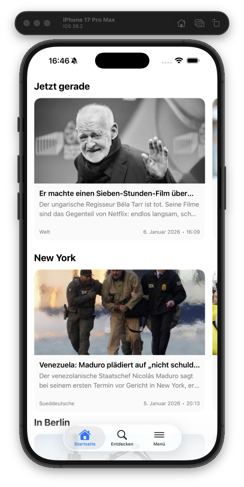
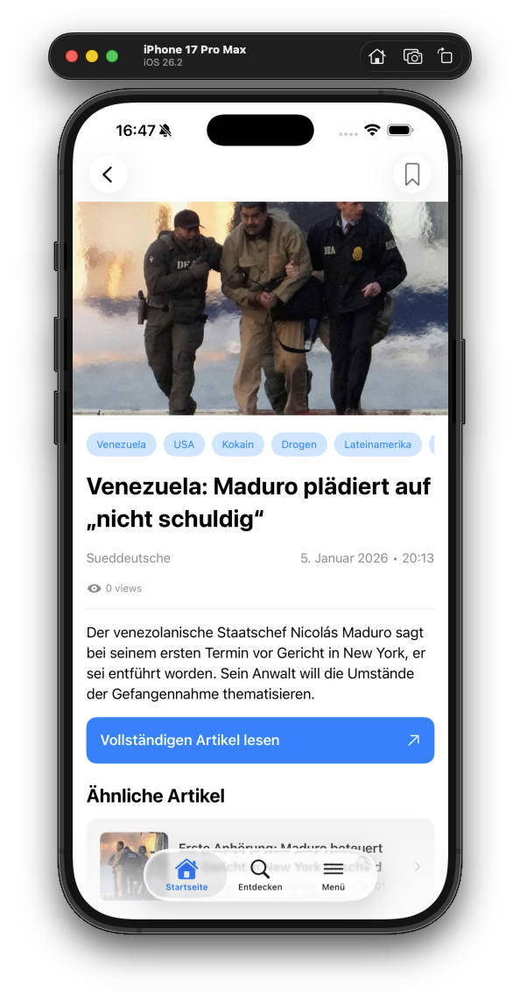

# Veritas

A news-reading app for people who want to verify information across multiple sources. Veritas aggregates news from various German media outlets and links related articles together, enabling readers to compare coverage and form their own informed opinions.

## Screenshots

  
  
  

## Features

- Aggregates news from multiple German news sources
- Automatically links related articles covering the same story
- Discover trending topics and keywords
- Save articles for later reading
- Clean, native iOS experience

## Tech Stack

### Backend
- **Language:** Go 1.24
- **API:** GraphQL (gqlgen)
- **Database:** PostgreSQL (GORM)
- **Cache:** Redis
- **Monitoring:** Prometheus
- **Scheduling:** Cron jobs for scraping and database maintenance

### iOS App
- **Language:** Swift
- **UI Framework:** SwiftUI
- **GraphQL Client:** Apollo iOS

### News Sources
- Tagesschau
- Zeit
- FAZ (Frankfurter Allgemeine Zeitung)
- Welt
- Süddeutsche Zeitung
- TAZ
- Handelsblatt
